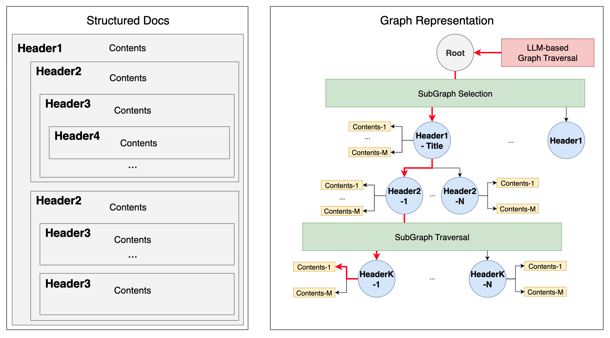
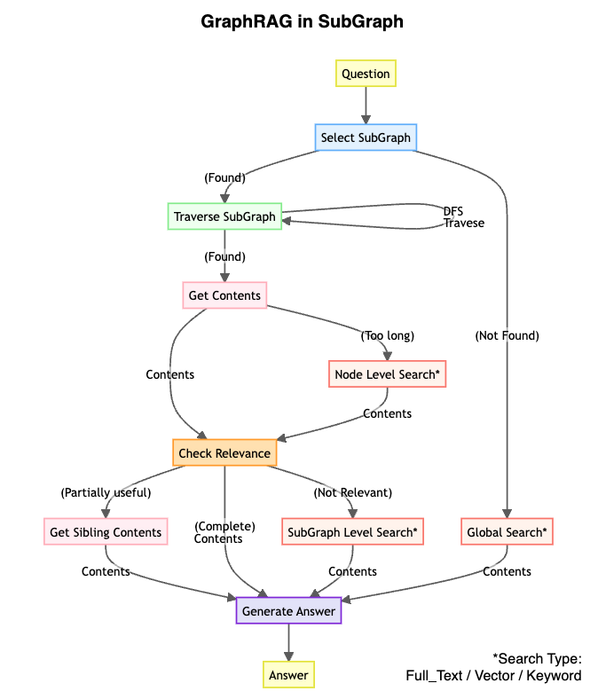
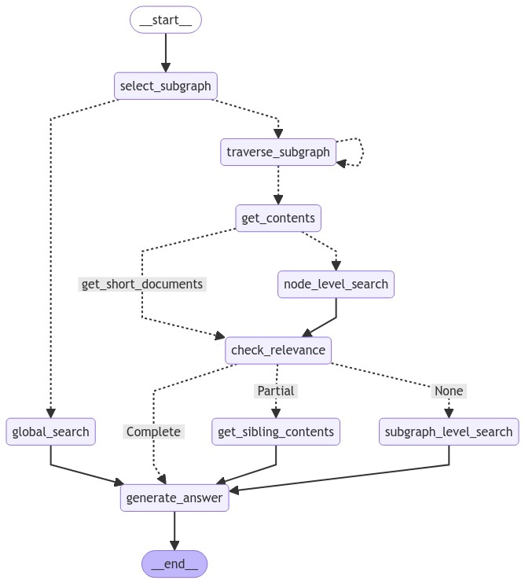
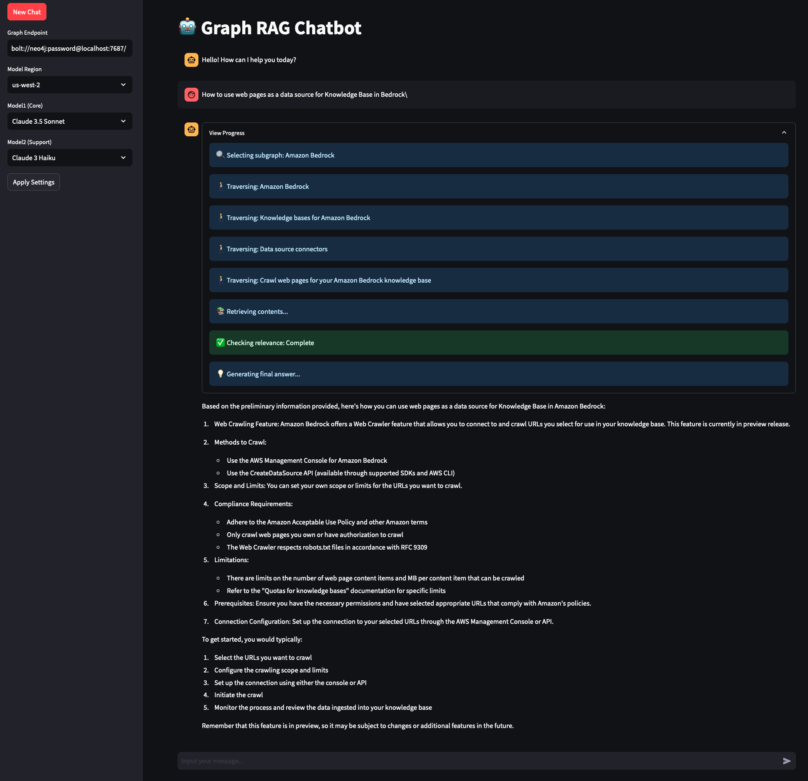

# graph-rag-bedrock

A Graph-based RAG System Implementation

## Overview

This project focuses on converting PDF documents into a graph-based knowledge base and implementing a Graph RAG system.

### Preprocessing

Common Graph RAG implementations use LLMs to extract entities from document content to construct a knowledge graph based on Graph DB. This approach has high entry barriers due to the cost and time required in the preprocessing stage. In this repository, we analyze the structure of documents during preprocessing and represent them in the graph as a multi-layered Parent-Child node structure between Headers. Each Header node is linked to document content related to that topic.

### Search Process

Common Graph RAG implementations construct graph queries (e.g., Cypher) using entities and relationships from the Graph DB when a user question is received, finding the desired context for the answer. In this repository, we start from the root node of each graph and explore it using DFS (Depth-First Search), allowing the LLM to determine which documents/menus to reference based on Header names. This approach may be suitable for document creation and structuring methods as it's similar to how humans explore information.

### Workflow

Depending on how well the document is structured by Headers and how the prompt is constructed, the graph exploration may not acquire the desired information. Alternatively, even if it reaches the Leaf node, there might be too many connected documents to use as context. To address this, we structure the search workflow as follows:

1. Explore the desired SubGraph (document) through graph traversal.
2. Search for the Header (topic) containing the desired information within the SubGraph.
3. Check the documents linked to the topic to verify if they are relevant context for the question.
4. If the context relevance is high, use it for answering.
5. If the relevance is low, provide a fallback method to search for context within a specific node/document or the entire document.
  - Note: Stage 5 is similar to the common RAG workflow. However, if it reaches a specific node successfully, it can perform a fine-grained search, potentially improving search accuracy.

### Expected Advantages

In common RAG approaches, documents are stored in chunks, and these are retrieved based on similarity search results. This can lead to missing chunks, order reversals, or collection of completely irrelevant chunks, potentially causing hallucinations. However, in Graph RAG, we first judge based on the relevance of the user's question to the topic, and then retrieve completed context from there, which can be advantageous in terms of information integrity.

### Limitations

This approach may have limited applicability for documents that are not well-structured by Headers.

## Prerequisites

Before starting the project, ensure you have Docker installed on your system. Then, set up the Neo4j container:

1. Make sure you have execution permissions for the script:

```chmod +x neo4j-install.sh```

2. Run the Neo4j installation script:

```./neo4j-install.sh```

## 1-Graph-RAG-Hands-on

### 1. Convert PDF to Markdown

- Utilize `1-raw-file-load.ipynb` notebook
- Leverage PyMuPDF4LLM library

### 2. Construct Graph Based on Document Components
- Utilize `2-data-transformation.ipynb` notebook



- Data cleansing: Remove unnecessary markdown components
- Separate document components based on markdown headers
- Chunking process:
  1. Primary chunking using delimiter '\n\n'
  2. Secondary chunking using delimiter '\n---\n'
  3. Tertiary chunking using delimiter '\n'
- (Optional) Convert text of each chunk to vector embeddings

### 3. Load Graph into Neo4j

- Utilize `3-graph-loading.ipynb` notebook
- Load the generated knowledge base into Neo4j graph database

### 4. Graph Traversal Logic Simulation (Dev)
- Utilize `4-graph-traversal.ipynb` notebook



- Develop and test graph-based search and inference logic

### 5. Workflow Configuration (LangGraph)
- Utilize `5-graph-rag-workflow.ipynb` notebook



- Configure the overall RAG system workflow using LangGraph

## 2-Graph-RAG-Chatbot
- Run `graph-rag-chatbot.py` script
```
cd 2-graph-rag-chatbot
streamlit run graph-rag-chatbot.py
```



## Dependencies

- PyMuPDF4LLM
- Neo4j
- LangGraph
- Streamlit
